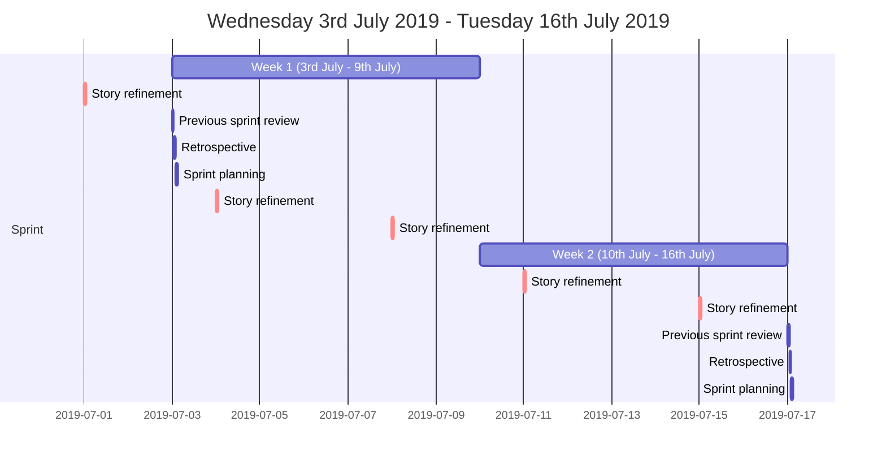

## Example Diary

| Week | Monday        | Tuesday | Wednesday                                               | Thursday      | Friday |
|------|---------------|---------|---------------------------------------------------------|---------------|--------|
| One  | Refinement 1h |         | Sprint Review 30m Retrospective 30m Sprint Planning 30m | Refinement 1h |        |
| Two  | Refinement 1h |         |                                                         | Refinement 1h |        |
